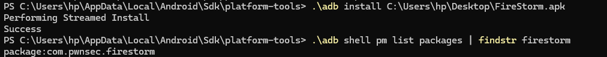
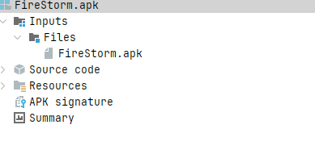
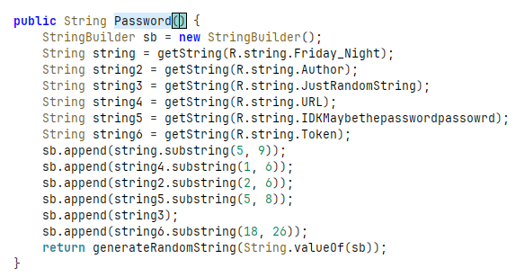
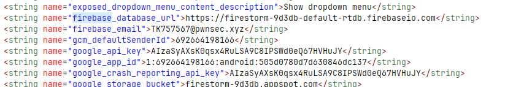
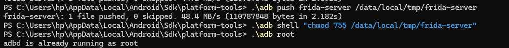
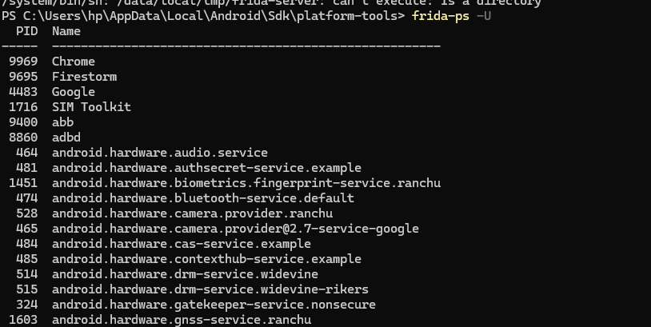
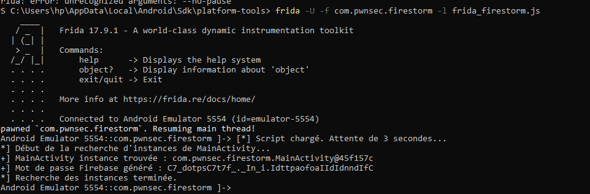
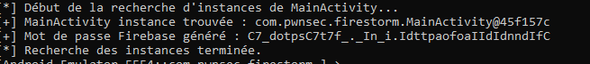
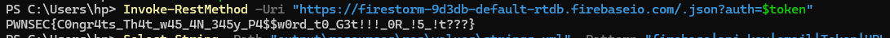

# lab18

## Objectif

Une fonction `Password()` existe dans l'application Android mais n'est jamais appelée dans le flux normal. L'objectif est de la forcer à s'exécuter avec Frida pour obtenir le mot de passe Firebase, puis récupérer le flag.

##  Étape 1 — Installation de l'APK et vérification ADB

---
## Étape 2 — Analyse statique avec Jadx

### Ouverture de l'APK

### Méthode Password() dans MainActivity

### strings.xml avec configuration Firebase

---

## Étape 3 — Installation de Frida Server

### Upload et lancement sur l'émulateur

### Vérification frida-ps -U

---

##  Étape 4 — Script Frida

### Lancement du script

### Mot de passe obtenu

---

---

## Étape 5 — Flag

---
auteur: FATIMAEZZAHRA ENNASSIRI

